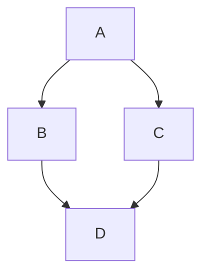

`vuepress-theme-hope` 通过内置
[md-enhance](https://vuepress-theme-hope.github.io/md-enhance)，在 Markdown 中新
增了更多的语法与新功能。

<!-- more -->

## 上下角标

19^th^ &nbsp; H~2~O

::: details 代码

```md
19^th^ H~2~O
```

:::

## 自定义对齐

::: center

我是居中的

:::

::: right

我在右对齐

:::

:::: details 代码

```md
::: center

我是居中的

:::

::: right

我在右对齐

:::
```

::::

## 脚注

此文字有脚注[^first].

[^first]: 这是脚注内容

::: details 代码

```md
此文字有脚注[^first].

[^first]: 这是脚注内容
```

:::

## 标记

你可以标记 ==重要的内容== 。

::: details 代码

```md
你可以标记 ==重要的内容== 。
```

:::

## 任务列表

- [x] 计划 1
- [ ] 计划 2

::: details Code

```md
- [x] 计划 1
- [ ] 计划 2
```

:::

## 流程图


::: details 代码

````md
```flow
cond=>condition: Process?
process=>operation: Process
e=>end: End

cond(yes)->process->e
cond(no)->e
```
````

:::

- [点击查看](https://vuepress-theme-hope.github.io/zh/guide/markdown/flowchart/)

## Mermaid


::: details 代码

````md

````

:::

- [点击查看](https://vuepress-theme-hope.github.io/zh/guide/markdown/mermaid/)

## Tex 语法

$$
\frac {\partial^r} {\partial \omega^r} \left(\frac {y^{\omega}} {\omega}\right)
= \left(\frac {y^{\omega}} {\omega}\right) \left\{(\log y)^r + \sum_{i=1}^r \frac {(-1)^i r \cdots (r-i+1) (\log y)^{r-i}} {\omega^i} \right\}
$$

::: details 代码

```md
$$
\frac {\partial^r} {\partial \omega^r} \left(\frac {y^{\omega}} {\omega}\right)
= \left(\frac {y^{\omega}} {\omega}\right) \left\{(\log y)^r + \sum_{i=1}^r \frac {(-1)^i r \cdots (r-i+1) (\log y)^{r-i}} {\omega^i} \right\}
$$
```

:::

## 代码案例


:::: details 代码

````md
::: demo 一个普通 Demo

```html
<h1>ChouCong</h1>
<p><span id="very">十分</span> 帅</p>
```

```js
document.querySelector('#very').addEventListener('click', () => {
  alert('十分帅')
})
```

```css
span {
  color: red;
}
```

:::
````

::::


:::: details 代码

````md
::: demo [react] 一个 React Demo

```js
export default class App extends React.Component {
  constructor(props) {
    super(props)
    this.state = { message: '十分帅' }
  }
  render() {
    return (
      <div className="box-react">
        ChouCong <span>{this.state.message}</span>
      </div>
    )
  }
}
```

```css
.box-react span {
  color: red;
}
```

:::
````

::::


:::: details 代码

````md
::: demo [vue] 一个 Vue Demo

```vue
<template>
  <div class="box">
    ChouCong <span>{{ message }}</span>
  </div>
</template>
<script>
export default {
  data: () => ({ message: '十分帅' }),
}
</script>
<style>
.box span {
  color: red;
}
</style>
```

:::
````

::::


:::: details 代码

````md
::: demo 一个使用浏览器不支持解析语言 Demo

```md
# 标题

十分帅
```

```ts
const message: string = 'ChouCong'

document.querySelector('h1').innerHTML = message
```

```scss
h1 {
  font-style: italic;

  + p {
    color: red;
  }
}
```

:::
````

::::

- [点击查看](https://vuepress-theme-hope.github.io/zh/guide/markdown/demo/)

## 幻灯片


::: details 代码

````md
@slidestart

## 幻灯片 1

一个有文字和 [链接](https://codenoob.top) 的段落

---

## 幻灯片 2

- 列表 1
- 列表 2

---

## 幻灯片 3.1

```js
const a = 1
```

--

## 幻灯片 3.2

$$
J(\theta_0,\theta_1) = \sum_{i=0}
$$

@slideend
````

:::

- [点击查看](https://vuepress-theme-hope.github.io/zh/guide/markdown/presentation/)

## 其他语法

:::note 自定义标题

信息容器

:::

:::tip 自定义标题

提示容器

:::

:::caution
 自定义标题

警告容器

:::

:::danger 自定义标题

危险容器

:::

::: details 自定义标题

详情容器

:::

:::: details 代码

```md
:::note 自定义标题

信息容器

:::

:::tip 自定义标题

提示容器

:::

:::caution
 自定义标题

警告容器

:::

:::danger 自定义标题

危险容器

:::

::: details 自定义标题

详情容器

:::
```

::::
