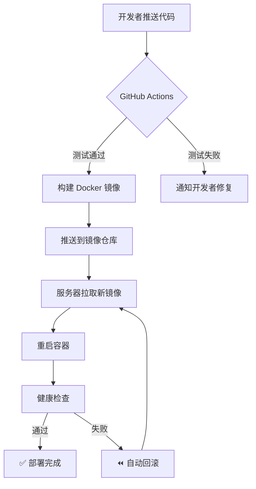
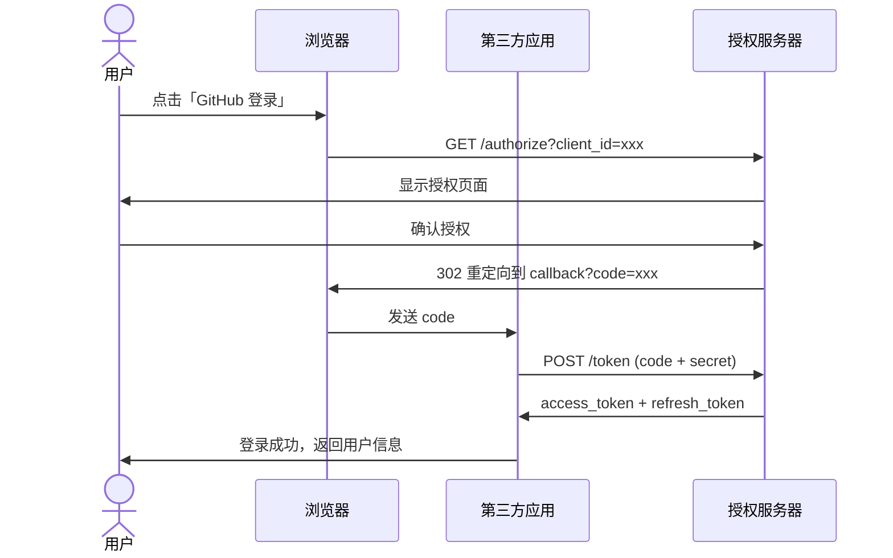
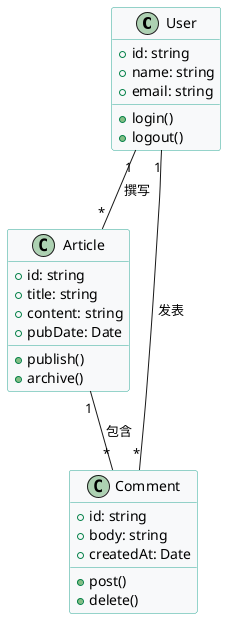
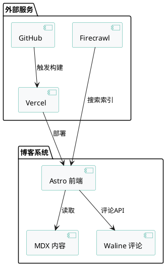

## 前言

这篇文章是 zcblog 的「功能演示页」，集中展示博客支持的全部渲染能力。如果你是新读者，可以通过这篇文章快速了解本博客的排版风格；如果你是主题开发者，这篇文章可以作为配置是否正常的检验标准。

下面按功能模块逐一展示，每个模块都有实际渲染示例。

---

## Mermaid 图表

本博客支持 Mermaid 语法，可以在文章里直接画流程图、时序图、类图等。

### 流程图

一个简单的部署流程：



### 时序图

OAuth 2.0 授权码流程：



---

## 代码块

支持语法高亮，标注语言后自动着色。以下展示几种常用语言。

```python
# Python: 装饰器示例
import time
from functools import wraps

def retry(max_attempts: int = 3, delay: float = 1.0):
    """失败自动重试的装饰器"""
    def decorator(func):
        @wraps(func)
        def wrapper(*args, **kwargs):
            for attempt in range(max_attempts):
                try:
                    return func(*args, **kwargs)
                except Exception as e:
                    if attempt == max_attempts - 1:
                        raise
                    time.sleep(delay * (attempt + 1))
        return wrapper
    return decorator
```

```yaml
# YAML: Docker Compose 配置
version: "3.8"
services:
  nginx-proxy-manager:
    image: jc21/nginx-proxy-manager:latest
    container_name: npm
    restart: unless-stopped
    ports:
      - "80:80"
      - "443:443"
      - "81:81"
    volumes:
      - ./data:/data
      - ./letsencrypt:/etc/letsencrypt
```

```bash
# Shell: 一键部署脚本
#!/bin/bash
set -e

echo "🔍 检查 Docker 环境..."
docker version > /dev/null 2>&1 || { echo "❌ 请先安装 Docker"; exit 1; }

echo "📦 拉取镜像..."
docker pull jc21/nginx-proxy-manager:latest

echo "🚀 启动服务..."
docker compose up -d

echo "✅ 部署完成，访问 http://localhost:81 进入管理面板"
```

```rust
// Rust: 一个简单的 HTTP 健康检查函数
use reqwest;

async fn health_check(url: &str) -> Result<bool, reqwest::Error> {
    let resp = reqwest::get(url).await?;
    Ok(resp.status().is_success())
}
```

---

## 表格

表格适合参数说明、方案对比等场景。

### 参数说明表

| 参数 | 类型 | 必填 | 默认值 | 说明 |
|------|------|------|--------|------|
| `max_attempts` | int | 否 | `3` | 最大重试次数 |
| `delay` | float | 否 | `1.0` | 重试间隔（秒） |
| `backoff` | bool | 否 | `true` | 是否启用指数退避 |
| `on_failure` | callable | 否 | `None` | 失败回调函数 |

### 方案对比表

| 方案 | 部署难度 | 资源占用 | 功能完整度 | 推荐场景 |
|------|---------|---------|-----------|---------|
| Nginx Proxy Manager | ⭐ 简单 | 低 | ⭐⭐⭐ | 个人/小团队 |
| Traefik | ⭐⭐ 中等 | 低 | ⭐⭐⭐⭐ | 容器化环境 |
| Caddy | ⭐ 简单 | 低 | ⭐⭐⭐ | 自动 HTTPS |
| Nginx 手写配置 | ⭐⭐⭐ 复杂 | 最低 | ⭐⭐⭐⭐⭐ | 极客/高性能 |

---

## Callout 容器

本博客支持四种 Callout 容器，用于在文章中突出不同性质的信息。

:::tip
这是一个 **提示** 容器。用于补充说明、小技巧、推荐做法等正面信息。比如：使用 `docker compose`（空格）而不是 `docker-compose`（连字符），新版 Docker 已经废弃后者。
:::

:::warning
这是一个 **警告** 容器。用于提醒注意事项、可能踩的坑。比如：修改 Nginx 配置后务必先执行 `nginx -t` 检查语法，否则直接 reload 可能导致服务不可用。
:::

:::danger
这是一个 **危险** 容器。用于强调绝对不能做的事、安全漏洞提醒等。比如：**绝对不要**在公网暴露没有密码的 Redis/MySQL 端口，否则几分钟内就会被扫描并植入挖矿脚本。
:::

:::note
这是一个 **笔记** 容器。用于记录备忘、背景知识、补充上下文等中性信息。有时候不同文档对同一个概念叫法不同——Vaultwarden 原名 `bitwarden_rs`，若在旧教程中看到这个名称，替换为 `vaultwarden/server` 即可。
:::

---

## 图片引用

[图：Mermaid 渲染效果截图 - 博客实际展示的流程图样式]

[图：Callout 容器在移动端和桌面端的对比效果]

---

## 数学公式

本博客支持 LaTeX 数学公式，由 KaTeX 渲染（构建时预渲染，比 MathJax 客户端渲染更快）。

行内公式：$E = mc^2$，时间复杂度 $O(n \log n)$。

块级公式：

$$
\sum_{i=1}^{n} i = \frac{n(n+1)}{2}
$$

贝叶斯定理：

$$
P(A|B) = \frac{P(B|A) \cdot P(A)}{P(B)}
$$

## PlantUML 图表

PlantUML 是一种用纯文本描述 UML 图的语言，本博客通过 remark 插件支持。适合画类图、组件图、部署图等。

### 类图示例



### 组件图示例



## Chart.js 图表

使用 `chart:类型` 语法嵌入 Chart.js 图表，支持 bar、line、pie、doughnut、radar 等类型。

### 柱状图

```chart:bar
{
  "labels": ["1月", "2月", "3月", "4月", "5月", "6月"],
  "datasets": [{
    "label": "博客访问量",
    "data": [1200, 1900, 1500, 2800, 3200, 4100],
    "backgroundColor": "rgba(46, 169, 151, 0.6)",
    "borderColor": "#2ea997",
    "borderWidth": 1
  }]
}
```

### 饼图

```chart:pie
{
  "labels": ["技术教程", "技巧分享", "折腾记录", "问题解决"],
  "datasets": [{
    "label": "文章分类占比",
    "data": [45, 25, 20, 10],
    "backgroundColor": ["#2ea997", "#f59e0b", "#ef4444", "#3b82f6"]
  }]
}
```

## Markmap 思维导图

用 Markdown 大纲语法直接生成交互式思维导图。

```markmap
## Astro 博客技术栈
- 框架
  - Astro 5.x
  - MDX 集成
  - View Transitions
- 样式
  - Tailwind CSS
  - 自定义 CSS 变量
  - Dark Mode 支持
- 内容
  - Markdown/MDX
  - Expressive Code 代码高亮
  - Mermaid 图表
  - PlantUML 图表
  - Chart.js 图表
  - Markmap 思维导图
  - KaTeX 数学公式
- 交互
  - Waline 评论系统
  - Fancybox 图片灯箱
  - 阅读进度条
- 部署
  - Vercel 自动部署
  - GitHub Actions
  - Firecrawl 搜索索引
```

## 常见问题（FAQ）

### 为什么有些 Mermaid 图不显示？

检查 frontmatter 的 `mermaid` 字段是否设为 `true`。在 `.md` 文件中默认是 `false`，需要手动开启。

### 代码块怎么指定语言？

在三个反引号后面直接写语言名称即可：```` ```python ````、```` ```yaml ````、```` ```bash ````。如果不写语言名，代码块不会有语法高亮。

### Callout 容器可以嵌套吗？

不建议嵌套。Callout 设计为独立的提示单元，嵌套会导致样式错乱。如果需要多层信息，用多个独立 Callout 间隔排列。

### 图片路径怎么写？

封面图：`../../assets/coverimage/xxx.png`

正文图片：`/assets/note/xxx.png`

路径是相对于文章文件位置的，封面图需要回退两级目录。

### 这篇文章的源码在哪里？

文件位于：
`/Users/chowcong/Documents/WebSiteCode/zcblog/src/content/article/blog-gong-neng-yan-shi.mdx`

你可以直接查看源码对比渲染效果，所有功能点都有完整示例。

### PlantUML 图不显示？

PlantUML 是 remark 插件，不需要在 frontmatter 开关。如果图不显示，检查 `@startuml` 和 `@enduml` 标记是否正确，以及 plantuml.com 服务是否可访问（图片由远程服务渲染）。

### Chart.js 图表语法是什么？

使用 ```` ```chart:类型 ```` 语法，类型支持 `bar`、`line`、`pie`、`doughnut`、`radar` 等。代码块内容是 Chart.js 格式的 JSON 数据。

### Markmap 和 Mermaid 有什么区别？

Mermaid 适合画流程图、时序图等结构化图表；Markmap 适合用大纲文本生成思维导图，语法就是普通 Markdown 的标题和列表。
