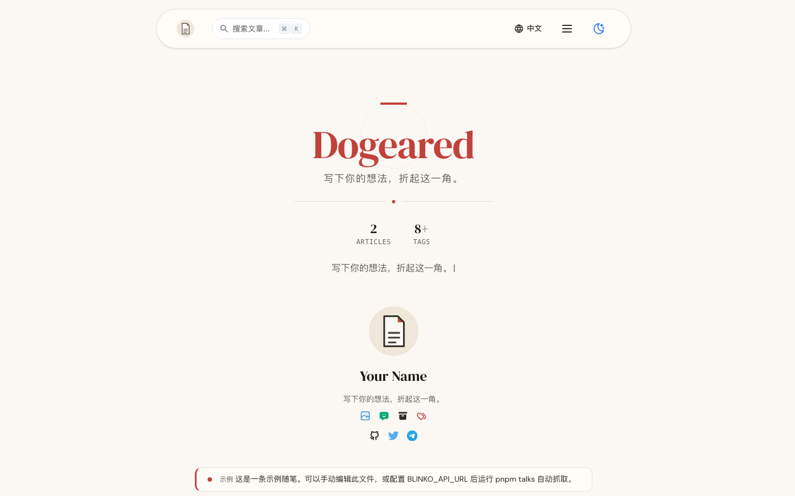
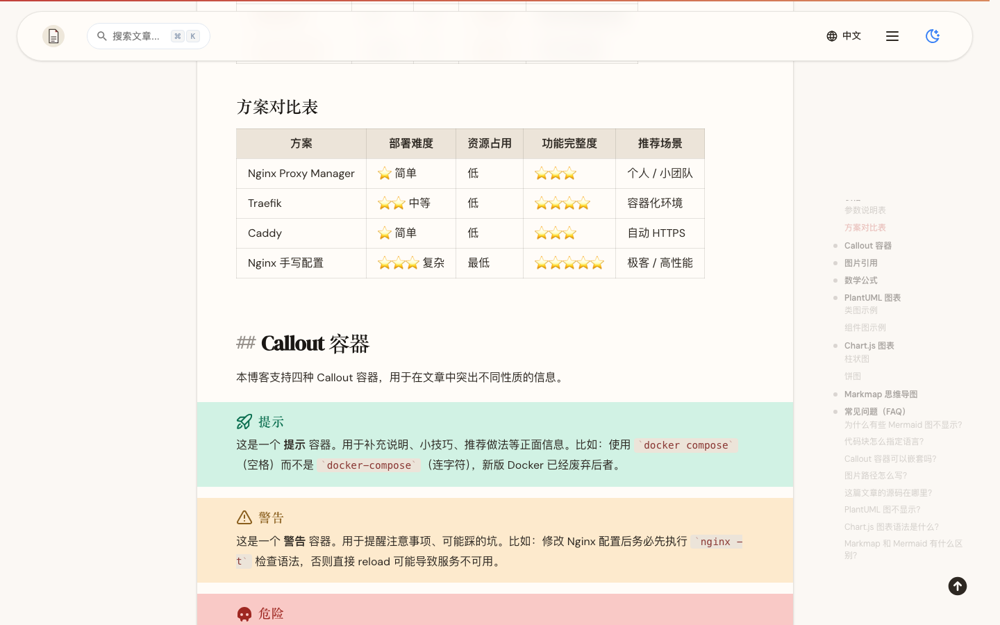
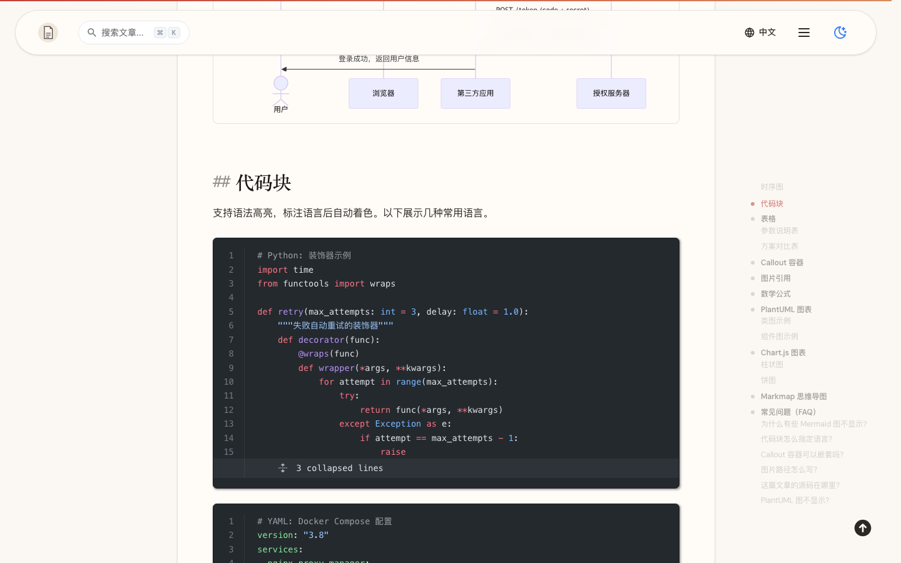
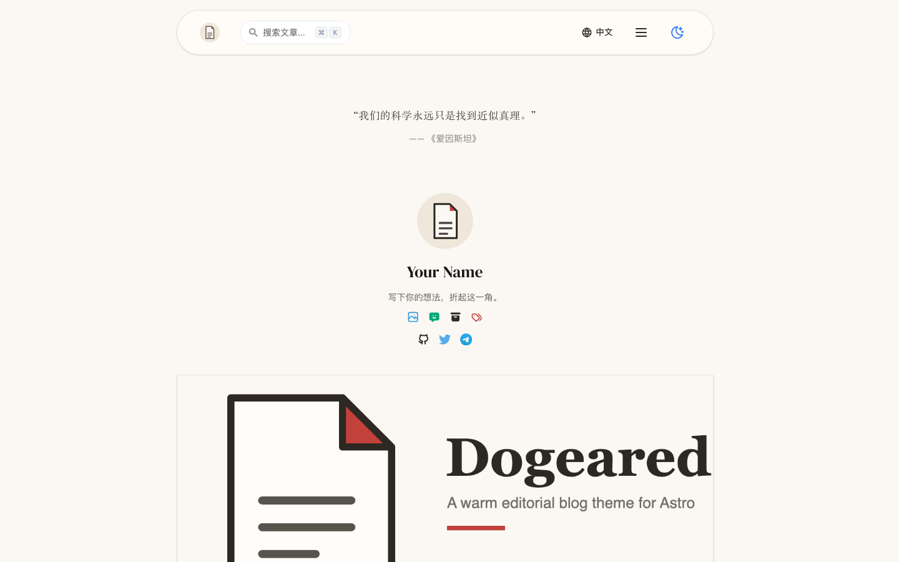
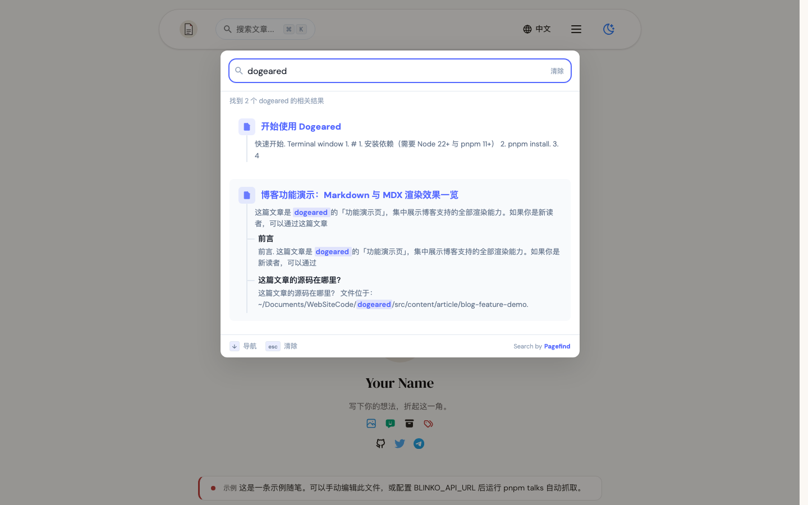

# Dogeared

**A warm editorial blog theme for Astro** — 暖纸底色、克制的排版、开箱即用的搜索、PWA、中英双语，以及一整套可选择的外部增强（评论 / 统计 / 图床 / 数据抓取）。


> 名字来自本主题的设计北极星 **"The Worn Notebook"**——"一只被反复使用、墨渍斑斑、卷了角的笔记本（ink-stained, **dog-eared**, warm from use）"。

<p align="center">
  <picture>
    <source media="(prefers-color-scheme: dark)" srcset="screenshots/home-dark.png">
    
  </picture>
</p>

| 文章页（Callout 容器）            | 代码块                          |
| --------------------------------- | ------------------------------- |
|  |  |

| 列表页                          | 搜索（Pagefind）                |
| ------------------------------- | ------------------------------- |
|  |  |

## 特性

- 🖋 **编辑风视觉**：暖纸配色、衬线标题、克制的装饰；亮 / 暗双主题均为第一等公民
- 🔍 **静态搜索**：Pagefind 构建期索引（⌘K 唤起），零后端；中英文文章统一收录
- 🌍 **双语（内容级）**：zh-CN / en 完整 i18n；英文文章以 `<slug>-en.md`（`lang: en`）发布，自动路由 `/en/article/<slug>/`，翻译对互标 hreflang、语言切换器直达对照版，列表 / 归档 / 标签 / 相关文章 / 订阅源按语言隔离
- 📝 **Markdown 增强**：Callout 容器、Tabs、图片网格、Mermaid / PlantUML / KaTeX / MathJax / Chart.js / Markmap、expressive-code 代码块（行号 / 折叠 / 复制）
- 🖼 **图片**：本地资源或图床（可选），未配置时自动回退占位图
- 💬 **可选能力**：Waline 评论、Umami 统计（含首页热门榜）、图床缩略图（Cloudflare Transformations）、友链申请自动化（GitHub Issue）、SEO 主动推送（IndexNow，部署后自动提交新/更新文章）、捐赠页、公告栏、水印、外链重定向（默认关闭，零侵入）
- 📱 **PWA**：可安装、离线可读（Workbox 缓存）
- 🧩 **数据页面**（全部可选）：随笔（Blinko）、豆瓣、Bangumi、相册、友链、服务页
- 📐 **自带设计系统**：完整的设计规范文档（Design Tokens / 组件规则）→ [`docs/design-guide.md`](docs/design-guide.md)

## 快速开始

要求：**Node 22+**、**pnpm 11+**。

```bash
pnpm install
pnpm dev        # 开发服务器 http://localhost:4321
pnpm build      # 构建到 dist/
pnpm preview    # 本地预览构建产物
```

推荐从 GitHub 的 **Use this template** 创建你自己的仓库；也可以：

```bash
degit yourname/dogeared my-blog && cd my-blog && pnpm install
```

常用命令：

| 命令              | 作用                                     |
| ----------------- | ---------------------------------------- |
| `pnpm dev`        | 开发服务器                               |
| `pnpm build`      | 构建（含数据抓取与校验，见「可选服务」） |
| `pnpm new-post`   | 交互式新建文章                           |
| `pnpm type-check` | TypeScript 检查                          |
| `pnpm test:unit`  | 单元测试（Vitest）                       |
| `pnpm test:e2e`   | 端到端测试（Playwright）                 |

## 配置

所有配置集中在 `src/config/`，改完即生效，无需动组件代码。

### `src/config/site.ts` — 站点基本信息

| 字段             | 说明                                         |
| ---------------- | -------------------------------------------- |
| `title`          | 站点标题（首页大标题、SEO、RSS）             |
| `subtitle`       | 站点副标题（首页口号）                       |
| `description`    | 站点描述（SEO / RSS）                         |
| `keywords`       | 站点关键字                                   |
| `favicon`        | 站点图标（放 `public/`）                     |
| `logo`           | 站点 logo（放 `public/`，用于头像等位置）    |
| `coverImage`     | 默认封面（放 `public/`）                     |
| `coverImageAlt`  | 默认封面 alt                                 |
| `url`            | 部署域名（如 `https://example.com`，含协议） |
| `domains`        | 域名白名单（用于外链重定向判定）             |
| `startYear`      | 建站年份（页脚版权区间）                     |
| `beian`          | ICP 备案号（留空则不显示）                   |
| `beianURL`       | 备案查询链接                                 |
| `shortName`      | PWA 短名（可选，缺省回退 `title`）           |
| `pwaDescription` | PWA 描述（可选，缺省回退 `description`）     |

### `src/config/feature.ts` — 功能开关

| 字段                                | 说明                                                       |
| ----------------------------------- | ---------------------------------------------------------- |
| `lang`                              | 默认语言 `zh-CN` / `en`                                    |
| `PageSize`                          | 列表分页数量                                               |
| `codeFoldingStartLines`             | 代码块超过多少行时折叠                                     |
| `ga`                                | Google Analytics ID（`false` 关闭）                        |
| `redirect` / `redirectIncludeClass` | 外链重定向（默认仅处理正文区链接）                         |
| `pageView` / `postView`             | 返回顶部、作者信息显示开关                                 |
| `donate.*`                          | 捐赠页：`enable`、`tip`、二维码路径、`paypalUrl`           |
| `waline.*`                          | 评论：`enable`、`serverUrl`、语言、分页、表情、搜索、白名单 |
| `search.enable`                     | Pagefind 站内搜索开关                                      |
| `umami.*`                           | 统计：`enable`、服务地址、站点 ID                          |
| `popular.*`                         | 热门文章：`enable`、展示条数 `limit`（数据由 Umami 抓取）  |
| `notice.*`                          | 公告栏：`enable`、内容、路径、记住关闭、确认按钮           |
| `watermark.*`                       | 全站水印：`enable`、文案、字号、透明度、旋转、颜色、间距   |

> 默认全部外部服务**关闭**：不配置也能完整构建与运行。

### `src/config/ui.ts` — 导航与链接

| 字段            | 说明                    |
| --------------- | ----------------------- |
| `navLinks`      | 主导航链接              |
| `categories`    | 汉堡菜单中的分类入口    |
| `socialLinks`   | 社交链接（图标 + 颜色） |
| `friendsPage`   | 友链页标题与说明；可选 `friendLinkApplyUrl` 申请入口（Issue 表单链接） |
| `footerList`    | 页脚徽标链接            |
| `sidebarConfig` | 文章页侧边栏目录        |

### `src/config/services.ts` — 服务页

`servicesZh` / `servicesEn`（服务条目：标题、图标、描述、交付方式、定价）+ `contactZh` / `contactEn`（微信 / Telegram / 邮箱）。清空数组时页面自动显示空态。

### i18n 文案

界面文案在 `src/data/i18n/zh.json` 与 `en.json`。其中 `site` 块包含站点的标题 / 副标题 / 描述（与 `site.ts` 两处都改才完全生效）。

## 写作

在 `src/content/article/` 下新建 `.md` 文件即可；`pnpm new-post` 提供交互式脚手架。

### 中英文双语约定

- **中文文章**：`<slug>.md`（`lang` 缺省即 zh）→ `/article/<slug>/`
- **英文文章**：`<slug>-en.md` + frontmatter `lang: en` → `/en/article/<slug>/`
  - 与中文版**同 base slug** 时自动互为翻译对：互相标注 `hreflang`、语言切换器直达对照版、sitemap 配对
  - 独立英文文章（无中文对照）也可以：切换器会回退到英文列表页，`hreflang` 仅含 en 与 x-default
  - ⚠️ 不要用 `<slug>.en.md` 命名：Astro 内容层会吞掉文件名中的英文句点，导致 URL 变成 `xxxen`
- 中英文内容**完全隔离**：各自独立的列表 / 归档 / 标签 / 相关文章 / 订阅源（`/en/rss.xml`、`/en/atom.xml`、`/en/feed.json`）

### Frontmatter 字段

| 字段                                                      | 类型     | 默认  | 说明                                       |
| --------------------------------------------------------- | -------- | ----- | ------------------------------------------ |
| `title`                                                   | string   | 必填  | 文章标题                                   |
| `pubDate`                                                 | date     | 必填  | 发布日期                                   |
| `lang`                                                    | zh / en  | zh    | 文章语言（英文文章建议配 `<slug>-en.md` 命名） |
| `description`                                             | string   | —     | 描述（SEO）                                |
| `summary`                                                 | string   | —     | 摘要（卡片 / RSS）                         |
| `upDate`                                                  | date     | —     | 更新日期                                   |
| `tags`                                                    | string[] | []    | 标签                                       |
| `image.url`                                               | 图片/URL | 占位  | 封面（本地相对路径或完整 URL；空 = 占位图） |
| `image.alt`                                               | string   | —     | 封面 alt                                   |
| `sticky`                                                  | number   | 0     | 置顶权重（越大越靠前）                     |
| `draft`                                                   | boolean  | false | 草稿（构建时排除）                         |
| `toc`                                                     | boolean  | true  | 显示目录                                   |
| `waline`                                                  | boolean  | true  | 该文是否显示评论区                         |
| `donate`                                                  | boolean  | true  | 该文是否显示赞赏                           |
| `author`                                                  | boolean  | true  | 该文是否显示作者卡片                       |
| `mathjax` `mermaid` `plantuml` `katex` `chart` `markmap`  | boolean  | false | 按需加载对应渲染器                         |
| `fancybox`                                                | boolean  | true  | 图片灯箱                                   |
| `tabs`                                                    | boolean  | true  | 启用 Tabs 容器                             |

### 容器语法速查

```markdown
:::tip[提示标题]
Callout 六种变体：tip / note / info / important / warning / danger
:::

:::tabs
@tab:标签一
内容一
@tab:标签二
内容二
:::

:::grid


:::

:::center
居中的内容（还有 :::right）
:::

:::github[owner/repo]
:::

:::include[./snippets/hello.md]
:::

:::encrypted[输入密码查看]
只有设置环境变量 ENCRYPTION_PASSWORD 时才能构建含加密内容的文章。
:::
```

## 可选服务

以下能力**默认关闭**、零侵入（不配置也不影响构建）：

| 功能        | 启用方式                                                                              |
| ----------- | ------------------------------------------------------------------------------------- |
| Waline 评论 | `feature.ts` 中 `waline.enable=true` + 填 `serverUrl`（自建服务参考 Waline 官方文档） |
| Umami 统计  | `feature.ts` 中 `umami.enable=true` + 服务地址与站点 ID                               |
| 热门文章    | `feature.ts` 中 `popular.enable=true`（需配置 `UMAMI_*` 环境变量抓取数据）             |
| 图床缩略图  | `site.ts` 中 `imageService.transform.enable=true`（需在域名所在 zone 开启 Cloudflare Image Transformations） |
| 友链申请    | `ui.ts` 中 `friendsPage.friendLinkApplyUrl` 填仓库 Issue 表单链接（配套 `.github/ISSUE_TEMPLATE/friend-link.yml` 与 `friend-link.yml` 工作流） |
| IndexNow 推送 | 仓库 Secrets 配 `INDEXNOW_KEY`，并在 `public/<key>.txt` 放置同名验证文件（内容 = key，文件名 = key）即启用：部署完成后自动提交新/更新文章到 IndexNow 网络（Bing / Yandex / Seznam / Naver / Yep）。可选配 `BAIDU_TOKEN` 同步百度普通收录；本地可 `pnpm seo:indexnow --all` 手工全量推送、`--dry-run` 预览 |
| GA 统计     | `feature.ts` 中 `ga` 填 GA-ID                                                          |
| 图床        | `site.ts` 中 `imageService.baseUrl`（留空则封面回退本地占位图 `/cover.png`）          |
| 捐赠页      | `feature.ts` 中 `donate.enable=true`（二维码图片置于 `src/assets/qr/`）               |
| 公告 / 水印 | `feature.ts` 中 `notice.enable` / `watermark.enable`                                   |
| 外链重定向  | 默认启用（正文区外链经 `/redirect` 中转，域名基于 `site.domains` 判定）               |

数据自动抓取（可选，构建前注入；未配置环境变量时脚本自动跳过）：

| 环境变量              | 作用                               |
| --------------------- | ---------------------------------- |
| `BLINKO_API_URL`      | Blinko 服务地址（随笔）            |
| `BLINKO_API_TOKEN`    | Blinko API Token                   |
| `DOUBAN_USER_ID`      | 豆瓣用户 ID                        |
| `BANGUMI_USER_ID`     | Bangumi 用户 ID                    |
| `FOREVERBLOG_RSS_URL` | Foreverblog RSS（友链）            |
| `UMAMI_API_URL`       | Umami 服务地址（热门文章）         |
| `UMAMI_WEBSITE_ID`    | Umami 站点 ID（热门文章）          |
| `UMAMI_USERNAME`      | Umami 只读账号用户名（热门文章）   |
| `UMAMI_PASSWORD`      | Umami 只读账号密码（热门文章）     |
| `ENCRYPTION_PASSWORD` | 加密文章密码（存在加密内容时必填） |
| `BUILD_CONCURRENCY`   | 构建并发数（默认 CPU 核数；低内存机器可设 1） |

完整说明见 `.env.example`。

## 部署

- **GitHub Pages（默认）**：推送到 `main` 即自动构建部署（`.github/workflows/deploy.yml`）。首次使用需在仓库 Settings → Pages 将 Source 设为 **GitHub Actions**。
- **其他平台**：Vercel / Netlify / Cloudflare Pages 均可。构建命令 `pnpm build`，输出目录 `dist`。

部署后记得把 `src/config/site.ts` 的 `url` 与 `domains` 改成你的真实域名。

## 项目结构

```text
src/
├── components/   # 组件（布局、文章、UI）
├── config/       # ← 你的所有配置都在这里
├── content/      # 文章（article/）与单页（pages/）
├── data/         # 数据文件 + i18n 文案
├── layouts/      # 页面布局
├── pages/        # 路由
├── styles/       # 设计令牌与全局样式
└── utils/        # 工具函数
scripts/          # 构建期脚本（数据抓取、校验、图标）
docs/             # 设计系统文档
screenshots/      # README 截图
```

## FAQ

- **评论不显示**：Waline 默认关闭，需 `waline.enable=true` 并提供 `serverUrl`。
- **封面图不显示**：`image.url` 留空时使用占位图；配置 `imageService.baseUrl` 后自动走图床。
- **搜索没结果**：搜索索引由 `pnpm build` 中的 Pagefind 步骤生成；`pnpm dev` 下需先构建一次。
- **构建报加密错误**：文章含 `:::encrypted[]` 时必须设置 `ENCRYPTION_PASSWORD`。
- **首次访问未看到开场动画**：动画只对首次访客播放一次（`localStorage` 记录），清除站点数据后可重看。

## 致谢与许可

由 **MarxChou** 制作与维护，从个人博客项目提取并通用化（[marxchou.com](https://marxchou.com)）。组件起点为 [Astro 官方 Minimal 模板](https://github.com/withastro/astro/tree/main/examples/minimal)（MIT）。

MIT License，可自由使用、修改与分发（保留许可证声明即可）。
